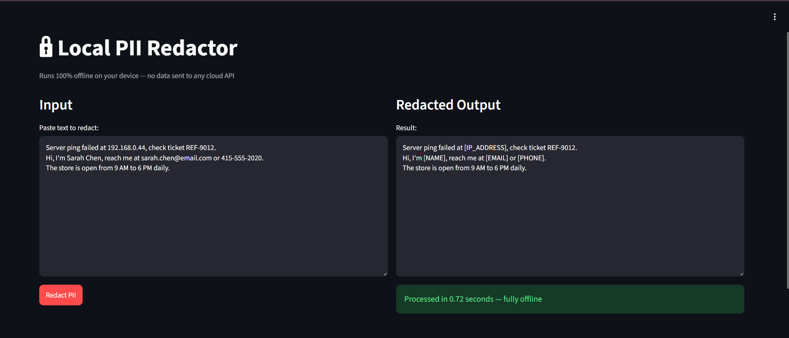
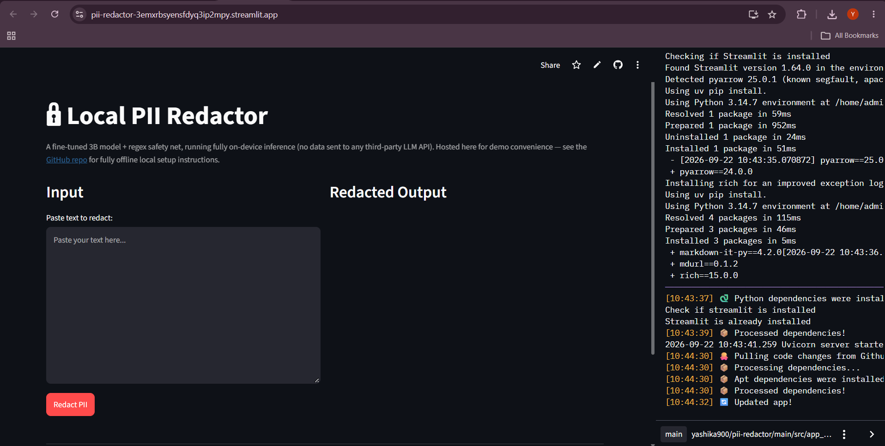

# 🔒 Local PII Redactor

A fine-tuned small language model that detects and redacts Personally
Identifiable Information (PII) from text — **entirely offline**, with no
data ever sent to an external cloud API.

Built by fine-tuning Llama 3.2 3B with LoRA on a custom synthetic dataset,
then quantizing and serving it locally via Ollama, backed by a regex-based
safety net for near-zero data leakage.

**Model on Hugging Face Hub:** [Yashika900/pii-redactor-llama3.2-3b](https://huggingface.co/Yashika900/pii-redactor-llama3.2-3b)

> **On hosting:** this project doesn't have a permanently-hosted live demo
> — free-tier cloud hosting (Streamlit Community Cloud, Hugging Face
> Spaces) doesn't provide enough RAM/compute to run a 3B-parameter model
> at no cost, and paying to host a 24/7 demo isn't worthwhile for a
> project whose entire premise is running locally. See the screenshots
> below for it in action, or follow [Getting started](#getting-started) to
> run it yourself in a few minutes.

---

## Demo

**Correctly redacting PII while leaving a ticket/reference number
untouched** (a false-positive bug found and fixed during development —
see [Known limitations](#known-limitations)):



**Running as a deployed Streamlit app**, confirming the end-to-end
pipeline (fine-tuned model → regex safety net → web UI) works outside the
development environment:



## Why

Before pasting sensitive text into a cloud LLM (support tickets, medical
notes, internal documents), it should be sanitized locally first — without
that sensitive text ever leaving the device. This project is a small, fast,
CPU-friendly model purpose-built for exactly that.

## How it works

```
Teacher Model (Groq API)
        │
        ▼
Synthetic Dataset (1,172 examples, 20 PII categories)
        │
        ▼
Fine-tuning: Llama 3.2 3B + LoRA (via Unsloth)
        │
        ▼
Merge → GGUF Export → Quantization (Q4_K_M, 1.88GB)
        │
        ▼
Ollama (local, offline model serving)
        │
        ▼
   Two-layer redaction
   ┌─────────────────────────────────────────┐
   │ 1. Fine-tuned model                      │
   │    → contextual PII (names, addresses)   │
   │ 2. Regex safety net                      │
   │    → structured PII (emails, phones,     │
   │      SSNs, IPs, credit cards, etc.)       │
   └─────────────────────────────────────────┘
        │
        ▼
   Streamlit Web App
```

The two-layer design exists because a small (3B) model, while fast and
private, can occasionally miss PII on long or complex inputs. The regex
layer catches anything structurally predictable that slips through —
empirically demonstrated to recover missed emails and IP addresses in
stress testing (see [Results](#results) below).

> **Note on the two app variants in this repo:** `src/app.py` uses Ollama
> and is the fully-offline, locally-run version. `src/app_cloud.py` uses
> `llama-cpp-python` instead, built while testing free cloud hosting
> options before concluding that paid compute would be required for a
> persistent demo. Both use the identical fine-tuned model and safety-net
> logic — only the serving mechanism differs.

## Results

| Metric | Result |
|---|---|
| Leakage rate (held-out validation, 118 examples) | **0.0%** (0 leaks) |
| Leakage rate on adversarial/stress-test inputs (full pipeline) | **0.0%** (0 leaks) |
| Average processing time | **~0.30s** per request (CPU, quantized) |
| Model size (quantized) | **1.88GB** (from 5.99GB f16, ~68% reduction) |
| Verified offline | ✅ Tested with network disabled on physical hardware |

## PII types detected

`NAME` `EMAIL` `PHONE` `ADDRESS` `DOB` `SSN` `CREDIT_CARD` `BANK_ACCOUNT`
`PASSPORT` `DRIVER_LICENSE` `IP_ADDRESS` `USERNAME` `PASSWORD` `URL` `ORG`
`DATE` `LICENSE_PLATE` `MEDICAL_ID` `EMPLOYEE_ID` `AGE`

## Tech stack

- **Data generation:** Groq API, Python
- **Fine-tuning:** [Unsloth](https://github.com/unslothai/unsloth), PyTorch, TRL, PEFT (LoRA)
- **Base model:** [Llama 3.2 3B Instruct](https://huggingface.co/unsloth/Llama-3.2-3B-Instruct)
- **Export/quantization:** [llama.cpp](https://github.com/ggml-org/llama.cpp) (GGUF, Q4_K_M)
- **Serving:** [Ollama](https://ollama.com) (local)
- **Safety net:** Python `re`
- **Interface:** [Streamlit](https://streamlit.io)

## Getting started

### Prerequisites
- Python 3.10+
- [Ollama](https://ollama.com/download) installed

### 1. Clone the repo
```bash
git clone https://github.com/yashika900/pii-redactor.git
cd pii-redactor
```

### 2. Install dependencies
```bash
pip install -r requirements.txt
```

### 3. Download the model

The quantized model (`pii_redactor_q4.gguf`, 1.88GB) and its `Modelfile`
are hosted on Hugging Face Hub:
👉 **https://huggingface.co/Yashika900/pii-redactor-llama3.2-3b**

Download both files from the "Files and versions" tab there, and place
them into this repo's `models/` folder:

```
pii-redactor/
└── models/
    ├── pii_redactor_q4.gguf
    └── Modelfile
```

Or download via the Hugging Face CLI:
```bash
python -c "from huggingface_hub import hf_hub_download; hf_hub_download(repo_id='Yashika900/pii-redactor-llama3.2-3b', filename='pii_redactor_q4.gguf', local_dir='models'); hf_hub_download(repo_id='Yashika900/pii-redactor-llama3.2-3b', filename='Modelfile', local_dir='models')"
```

### 4. Load the model into Ollama
```bash
cd models
ollama create pii-redactor -f Modelfile
```

### 5. Run the app
```bash
cd ../src
streamlit run app.py
```

Open `http://localhost:8501` and paste in text to redact.

### CLI usage
```bash
ollama run pii-redactor "Your text here"
```

## Running tests

```bash
pytest tests/ -v
```

11 tests covering core redaction behavior and regression tests for real
bugs found during development (e.g. phone numbers vs. credit cards,
false-positive license plate detection on reference numbers).

## Project structure

```
pii-redactor/
├── src/
│   ├── inference/
│   │   ├── redactor.py           # PIIRedactor (Ollama) — local/offline use
│   │   ├── llamacpp_redactor.py  # PIIRedactorCloud — cloud hosting experiment
│   │   └── regex_patterns.py     # Safety-net regex layer
│   ├── data_generation/
│   │   └── generate_dataset.py
│   ├── app.py                    # Local Streamlit app (Ollama-based)
│   └── app_cloud.py               # Cloud-hosting variant (llama-cpp-python)
├── tests/
│   └── test_regex_patterns.py
├── data/
│   └── synthetic_dataset_clean.jsonl
├── models/
│   └── Modelfile
├── docs/
│   └── screenshots/
├── .github/workflows/tests.yml
└── requirements.txt
```

## Known limitations

- Minor text-duplication artifacts can occasionally appear on long
  generations (cosmetic only — doesn't affect redaction accuracy)
- Behavior on random/gibberish (out-of-distribution) input is undefined,
  and very short, context-free fragments can occasionally be misclassified
- Business/generic emails aren't always perfectly distinguished from
  personal ones
- An earlier version falsely flagged reference/ticket numbers (e.g.
  `REF-9012`) as license plates due to an overly broad regex pattern;
  fixed by requiring explicit "license plate" context (see
  `tests/test_regex_patterns.py` for the regression test)

These are documented here deliberately — they were found through genuine
stress testing, not glossed over.

## Author

**Author:** [Yashika Harwani](https://github.com/yashika900)
## License

MIT
